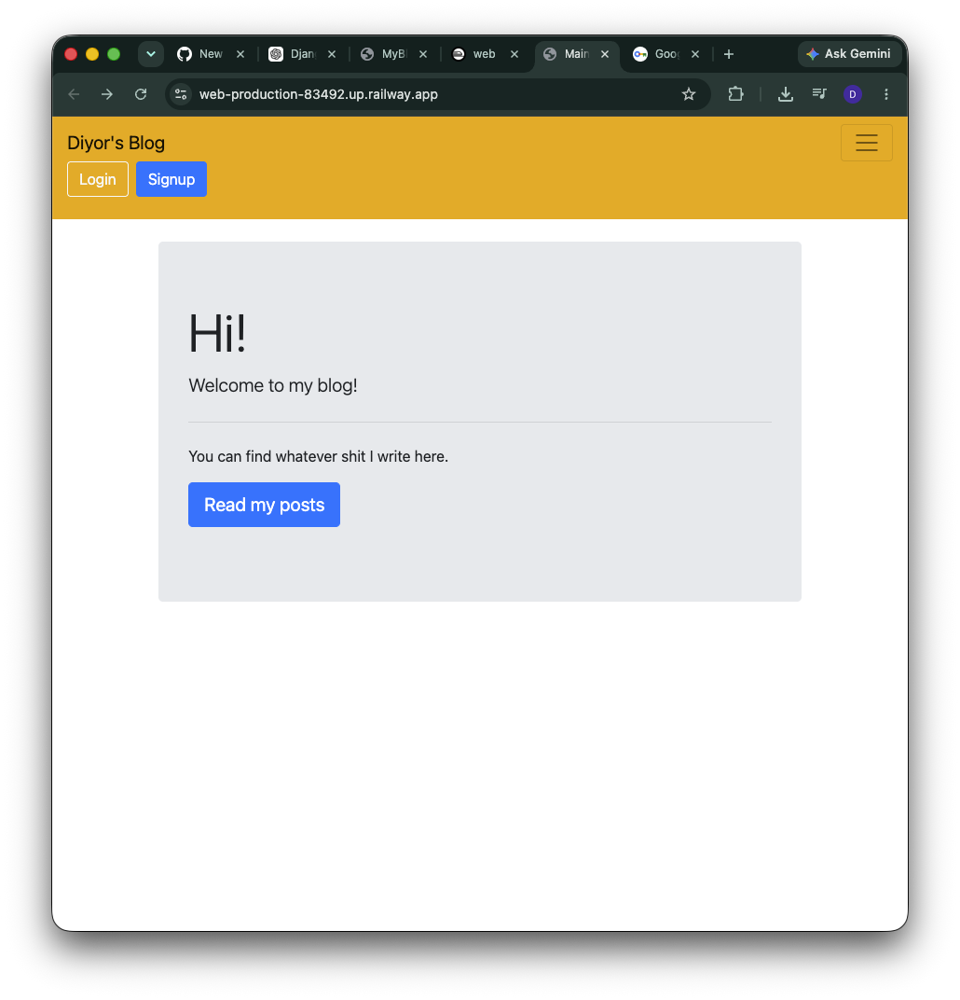
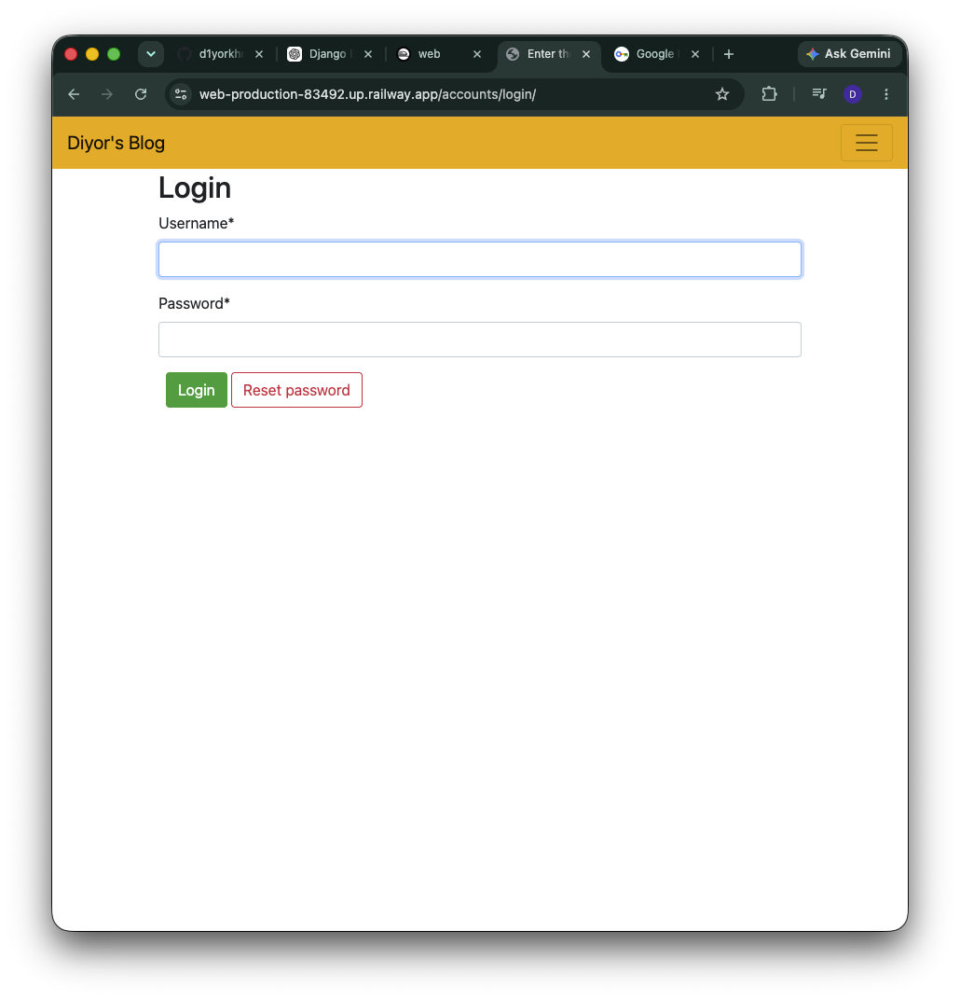
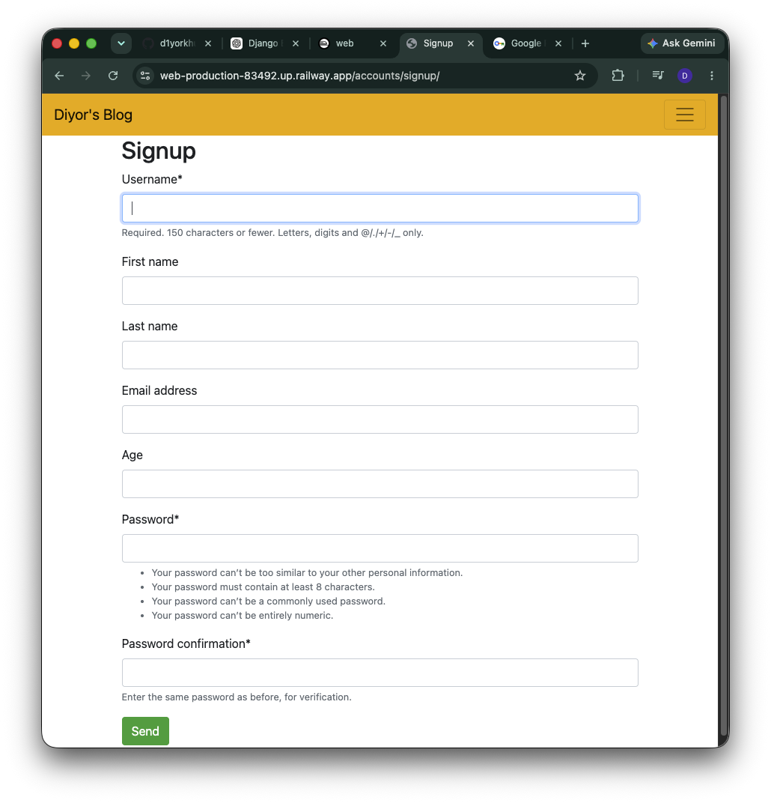
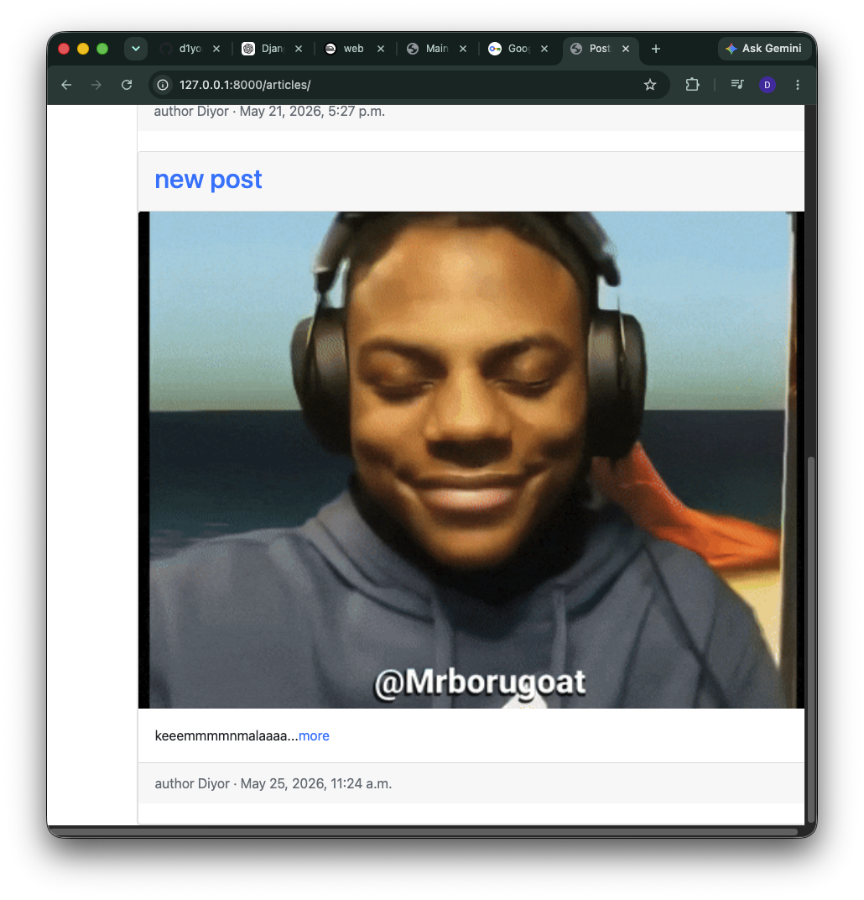
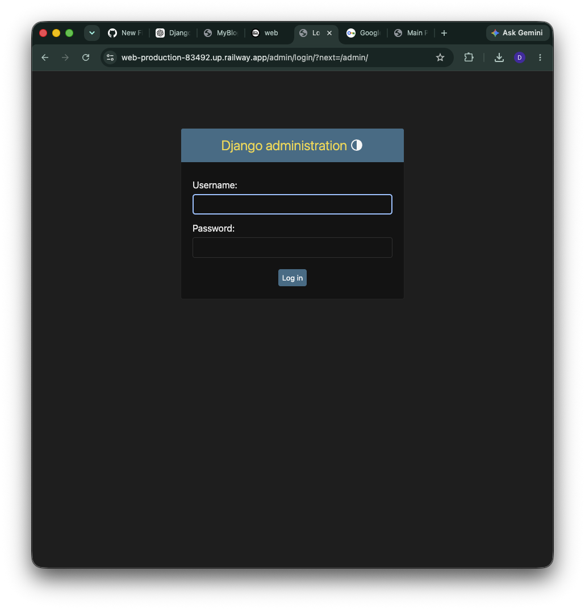
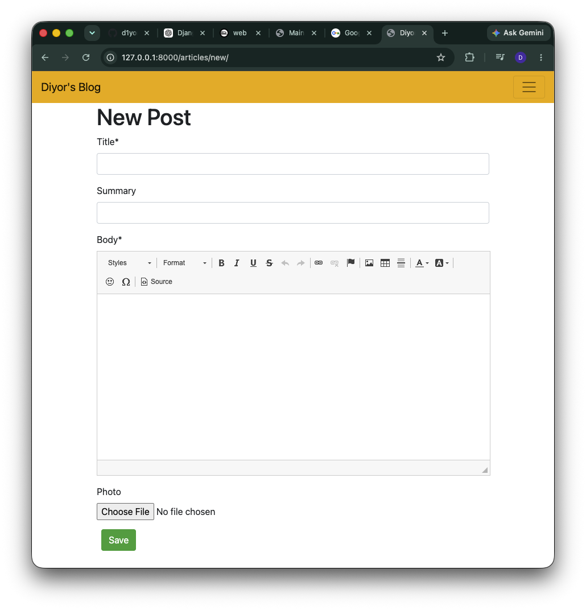

# MyBlog

A full-featured blog application built with Django.

## Overview

MyBlog is a web application that allows users to create accounts, log in, read articles, and manage blog content through Django's administration panel.

The project was developed to learn Django fundamentals, including:

* Authentication
* Article creation through the website
* Article editing and deletion
* Comment system
* Rich text editor
* Email verification
* Class-Based Views
* Database Models
* Templates
* Static Files
* PostgreSQL
* Deployment

---

## Features

* User Registration (Sign Up)
* User Authentication (Login / Logout)
* Blog Article Listing
* Individual Article Detail Pages
* Django Admin Panel
* PostgreSQL Database Support
* Static File Management with WhiteNoise
* Railway Deployment

---

## Technologies Used

* Python
* Django
* PostgreSQL
* HTML
* CSS
* WhiteNoise
* Gunicorn
* Railway
* Git
* GitHub

---

## Screenshots

### Home Page



### Login Page



### Signup Page



### Blog Article Page



### Django Admin Panel



### Rich Text Editing



---

## Installation

Clone the repository:

```bash
git clone https://github.com/d1yorkhud/myBlog.git
cd myBlog
```

Install dependencies:

```bash
pipenv install
```

Run migrations:

```bash
pipenv run python manage.py migrate
```

Create a superuser:

```bash
pipenv run python manage.py createsuperuser
```

Start the development server:

```bash
pipenv run python manage.py runserver
```

Visit:

```text
http://127.0.0.1:8000
```

---

## Project Structure

```text
myBlog/
├── accounts/
├── articles/
├── config/
|-- media/
├── static/
├── templates/
├── screenshots/
├── manage.py
├── Pipfile
├── Procfile
├── README.md
└── .gitignore
```

---
